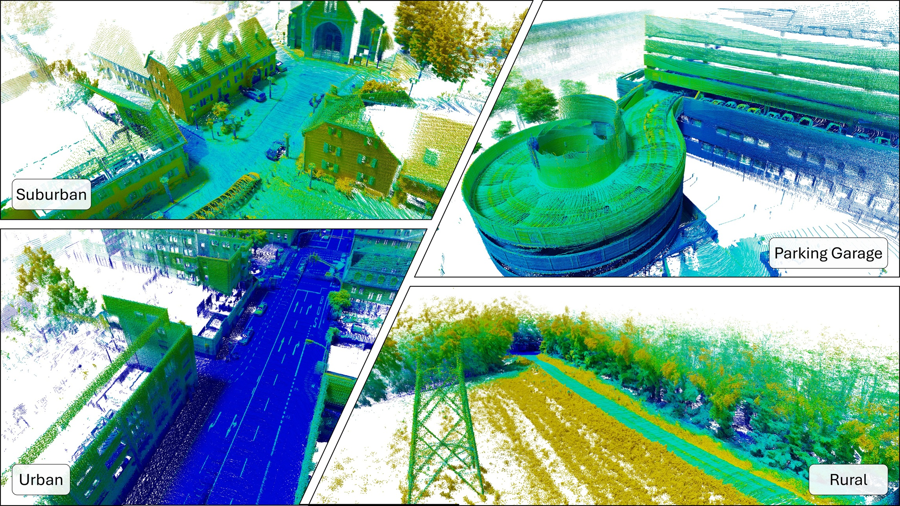

# Odyssey Devkit
<p align="center">
  <font size="12">  
    <a href="https://arxiv.org/abs/2512.14428">[PAPER]</a>
  </font>
    <font size="12">  
    <a href="https://odyssey.uni-goettingen.de/">[DOWNLOAD]</a>
  </font>
</p>

# ⚠ Our data has been updated ⚠
We have updated our dataset, paper and dataloader. All downloaded data before the 12.06.2026 is outdated. Please visit our [homepage](https://odyssey.uni-goettingen.de/) and download our new data.



Odyssey is an automotive dataset taylored towards localization tasks such as lidar-inertial-odometry (LIO). This repository contains all accompanying code, including the Python dataloader as well as examples for its usage.


# Python Dependencies
- Numpy
- Scipy
- Matplotlib

# Quickstart
Clone this repo with
```bash
git clone git@github.com:Fusion-Goettingen/odyssey-devkit.git
cd odyssey-devkit
```
modify the `base_dir` and `seq` in `example.py` to point to the directory of the Odyssey dataset and execute with
```bash
python3 example.py
```
to see our dataloader in action.